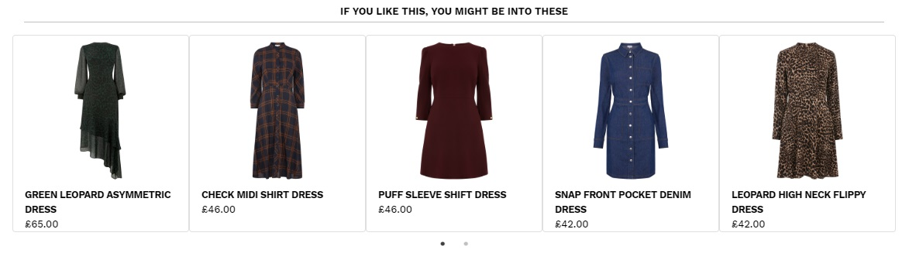

# Warehouse Web Developer Exercise



## Usage
```
showRecommendations(<target id>, 
                    <json file to load>, 
                    <number of recommendations to show at once>, 
                    <max number of recommendations to use from json>)
```

Inserts HTML elements for a recommendation view at the target id, by making an AJAX request to download a recommendations JSON file. The number of recommendation cards visible is controlled by the third parameter, while the final parameter indicates the maximum number of cards. Cards not currently visible are made accessible via a carousel control.  

### Example code
```JavaScript
$(document).ready(function () {
    $.getJSON("data/recommendations.json", function (recommendationsJSON) {
        showRecommendations("#recommendations", recommendationsJSON, 5, 7);

    });
});
```

Live [example](https://millieclare.github.io/developer-exercise/).

## Technical Choices
### Libraries
[Bootstrap 4.1.3](http://getbootstrap.com/), [jQuery 3.3.1](https://jquery.com/), [Slick 1.8.0](http://kenwheeler.github.io/slick/) for layout, DOM manipulation and AJAX requests, and carousel of recommendation cards

## Implementation Notes
- Uses the [ES6 Intl object](https://developer.mozilla.org/en-US/docs/Web/JavaScript/Reference/Global_Objects/Intl) to display currency appropriately for the browser locale
- Filters out products that don't have an image property, since it's not clear what should be displayed in these cases

```JavaScript
 let recommendationsArray = recommendationsData.hits.filter(recommendation => {
        return recommendation.hasOwnProperty('image');
    }).slice(0, maxRecommendations);
```
- Responsive through use of Bootstrap's grid system, with sensible break points set automatically
- Separate carousel control to allow recommendations to be visible without scrolling 
- Accessibility options: alt text on images, and font-size as small for better magnification options

## Testing
- Tested in Firefox, Safari and [Chrome](images/recommendations_display.jpg) browsers
- Tested locally using npm http-server and remotely via github.io
- Used [Device Toolbar](images/recommendations_display_iphone.jpg) to test responsiveness. 
- Separately check on iPhone 8 Plus, iPhone 8, iPhone 7 Plus, iPhone X, the OnePlus 5, Samsung Galaxy S7 and the Samsung Galaxy A3.

## Issues
- Images linked in json are large files but displayed at small size. Affects load times on slow connections. Thumbnail images in the json file would be better.
- Resizing cards for image size is occasionally unreliable (load event handler)
- Identifying browser locale for correct currency display is awkward. Assuming 'en-GB' for now.
- Links provided are all broken, but the items are current Warehouse collection. Working links would also enable other features, such as changing the image to a model wearing the piece on hover.
- Font in the screenshot is HelveticaNeue, but this isn't freely available outside of Apple devices. Possible alternatives are Work Sans from Google Fonts (used via CSS here), or Roboto.
